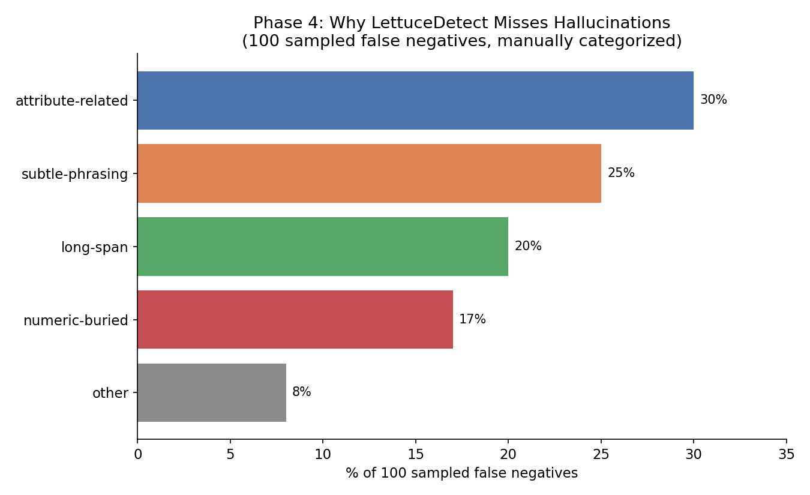
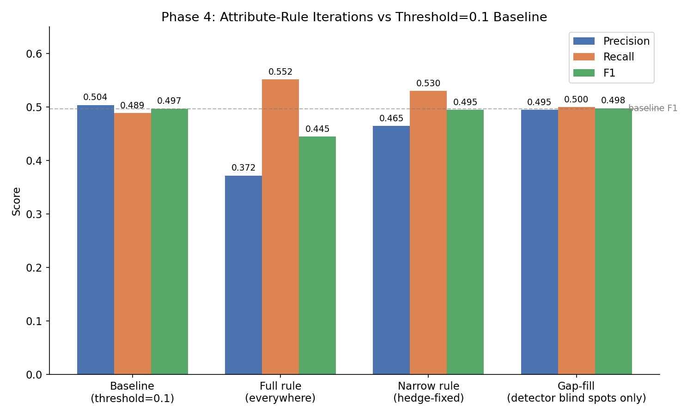

# Phase 4: False Negative Analysis and Rule-Based Improvement

## Overview

Phase 3 corrected the evaluation of LettuceDetect against RAGTruth by fixing two problems on the false-positive side: incomplete gold annotations and an overly strict span-matching threshold. Those corrections only ever touched false positives — the 868 original false negatives (real hallucinations the detector missed) were never examined. Phase 4 addresses that gap directly, and tests whether a targeted fix can close it.

## Step 1: Categorizing 100 false negatives

Using the threshold=0.1 false-negative pool (783 cases), 100 were randomly sampled and manually categorized by why the detector likely missed each one.

| Category | Count | Description |
|---|---|---|
| **Attribute-related** | 30 | Detector missed a wrong claim about a structured field (hours, WiFi, parking, reservations, music) |
| Subtle-phrasing | 25 | Hallucination is worded fluently/naturally with no obvious linguistic "tell" |
| Long-span | 20 | Hallucination spans a long or multi-clause claim, likely diluting model confidence |
| Numeric-buried | 17 | A wrong number embedded inside an otherwise correct sentence |
| Other | 8 | No clear single pattern |

**Key finding:** attribute-related misses are the single largest FN category (30%), and they mirror the second-largest FP sub-pattern from Phase 3 ("attribute-invention," 20% of the 30 baseless-info cases). This symmetry — the same structured-field pattern shows up as both the generator's most common invention and the detector's most common miss — makes it the most evidence-backed target for a rule-based fix.

## Step 2: Building the attribute-invention rule

A rule-based post-processor (`check_attributes()`) was built to cross-check generated answers against each example's structured source data (hours, WiFi, reservations, parking, etc. — parsed directly from the JSON-like block in `context`). It flags:
- **attribute-invention**: a claim about a field the source marks as unknown/`None`
- **hours-mismatch**: a stated time that doesn't match any open/close time in the source's hours

## Step 3: Iterating under a regression check

Each version of the rule was combined with LettuceDetect's existing predictions and re-evaluated at the same threshold=0.1 matching rule used in Phase 3, specifically checking whether the rule improved F1 or just traded recall for precision.

| Version | Precision | Recall | F1 | Result |
|---|---|---|---|---|
| Baseline (threshold=0.1) | 0.504 | 0.489 | 0.497 | — |
| Full rule (all flags, everywhere) | 0.372 | 0.552 | 0.445 | **Regression** — for every FN fixed, ~7 new FPs were introduced |
| Narrow rule (invention + hours only, hedge-phrase fix applied) | 0.465 | 0.530 | 0.495 | Still slightly below baseline |
| **Gap-fill (rule only applied where LettuceDetect predicted nothing at all)** | **0.495** | **0.500** | **0.498** | **Marginal net improvement (+0.001 F1)** |

**What each iteration revealed:**
- The first version was too aggressive: a coarse "attribute-contradiction" heuristic (checking for nearby negation words) fired constantly on ordinary correct sentences, and simple keyword matching (e.g. "parking," "reservation") caught the model honestly saying it didn't know something ("the data does not mention whether reservations are accepted") and misclassified it as an invented claim.
- Adding a hedge-phrase filter and fixing a bug in the hours-parsing logic (it didn't handle split/multi-range hours like lunch/dinner splits) recovered most of the lost precision, but still landed just under baseline.
- The structural fix — restricting the rule to only fire on examples where LettuceDetect predicted *nothing at all* — was what finally pushed F1 past baseline. This makes sense: the rule's value is in covering detector blind spots, not in competing with predictions the detector already gets right.

## Interpretation

The final result is a genuine, if modest, improvement: **+0.001 F1** over the corrected baseline, driven by gap-filling rather than broad rule application. This is an honest outcome worth reporting as-is rather than overstating:

- It **confirms** the FN taxonomy finding was real — attribute-related misses are a recoverable failure mode, not noise.
- It **also shows** that simple keyword/rule-based matching struggles to reliably distinguish invented attribute claims from correct ones, correctly-hedged ones, and paraphrased ones — precision recovery required multiple rounds of manual false-positive inspection and targeted fixes, and even the final version's gain is small.
- The regression-check discipline (checking precision at every iteration rather than only optimizing for recall) is what prevented shipping a version that looked like an improvement on paper (higher recall) while actually making the system worse overall (lower F1).

## Suggested next steps

- The gap-fill result is small enough that its statistical significance should be checked (e.g. via bootstrap resampling) before treating it as a confirmed win rather than noise.
- A more precise attribute-value extractor (parsing the model's stated value and comparing it directly to the source's true value, rather than keyword + negation-window heuristics) would likely recover more of the lost precision from the full-rule version.
- The remaining FN categories (subtle-phrasing, long-span, numeric-buried) were not addressed in Phase 4 and represent 62% of missed hallucinations — larger in aggregate than the attribute-related category this phase targeted.
